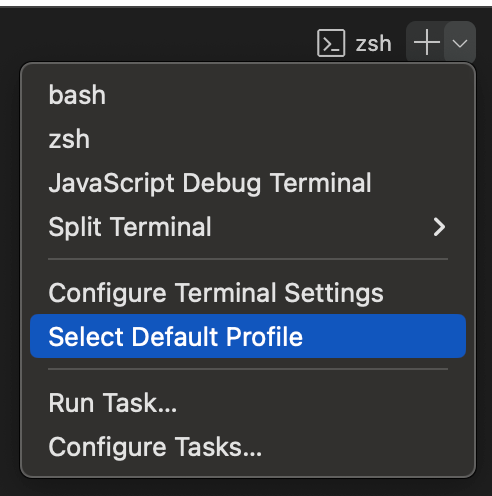
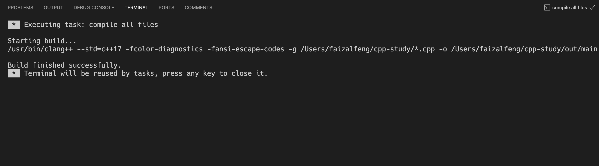

# C++&VS Code
> 在编译若干个.cpp文件时需要注意，这些.cpp文件中必须要含有main()函数入口，否则编译会出现错误


## tasks.json
```
{
    "tasks": [
        {
            "type": "cppbuild",
            "label": "compile all files",
            "command": "/usr/bin/clang++",
            "args": [
                "--std=c++17",
                "-fcolor-diagnostics",
                "-fansi-escape-codes",
                "-g",
                "${workspaceFolder}/*.cpp",
                "-o",
                "${workspaceFolder}/out/exec",
            ],
            "options": {
                "cwd": "${fileDirname}"
            },
            "problemMatcher": [
                "$gcc"
            ],
            "group": {
                "kind": "build",
                "isDefault": true
            },
            "detail": "Task generated by Debugger."
        }
    ],

    "version": "2.0.0"
}
```
:loudspeaker:参数解释
- "tasks":任务组，类型为list，可以在其中以json的格式写入多个任务
- "type":任务类型，默认即可
- "label":任务名称，自定义，方便在终端run task时找到
- "command":要执行的命令，cpp中为clang++所在路径
- "args":要传入的参数
- "options": "cwd"默认当前文件路径名
- "problemMatcher": clang下默认为“$gcc”
- "group": "kind": 任务组别 "idDefault": 是否为默认任务

 ---

## 运行编译
- 定义好任务后，直接通过terminal的Run Task选择上面label参数中定义好的任务名进行编译
<div style="text-align:left">

</div>

<div style="text-align:center">

</div>

> 编译成功！可cd到输出目录直接运行