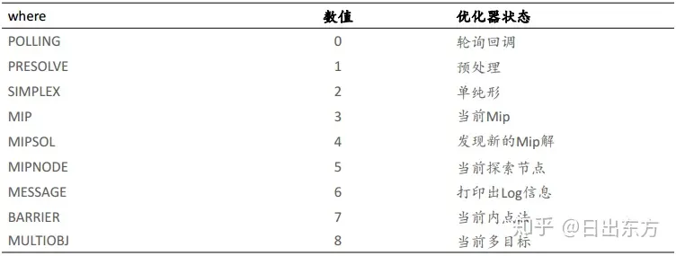
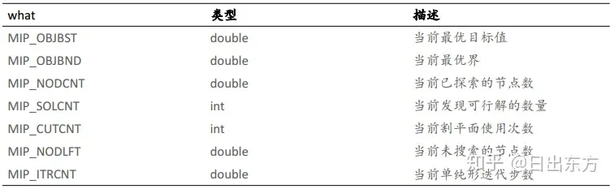
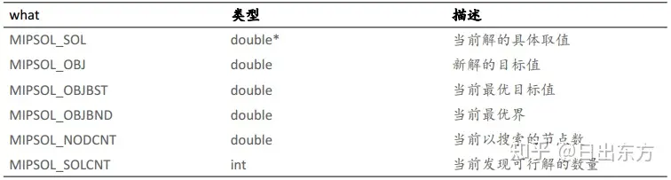

# Callback

:star:在模型求解过程中进行更细致的控制

* callback在model.optimize()时传入
* callback有两个关键参数：**where**&**what**，二者相互关联：
    1. where取值：

    2. what值取决于where的取值，例如where取MIP时，what取值如下：

当 where = MIPSOL 时，what取值如下：


示例代码：
```
def mycallback(model, where):
    if where == GRB.Callback.SIMPLEX:
        print(model.cbGet(GRB.Callback.SPX_OBJVAL))
model.optimize(mycallback)
```