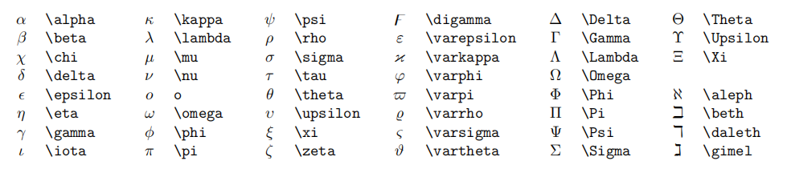

# 一级标题

## 二级标题

### 三级标题

每写完一个段落要隔一行空行.

就像这样, 隔了一行空行.

---

分割线

**重点加粗**

*斜体*

~~删除线~~

---

列表:

* 无序列表
  * 嵌套无序列表
  * 嵌套无序列表
* 无序列表
* 无序列表

1. 有序列表 1
   1. 嵌套有序列表 1
   2. 嵌套有序列表 2
2. 有序列表 2
3. 有序列表 3

---

引用文本:

> 引用别人说的话
> 就这样写
> By. OrangeX4

---

这是 `行内代码` 语法.

代码块语法:

``` python {.line-numbers}
print("Hello, World!")
```

注意:请将 ' 替换成 `.

---

[超链接名称](链接地址)


---

表格:

| 表头 | 表头 |
| ---- | ---- |
| 内容 | 内容 |
| 内容 | 内容 |

---

==高亮==

注释:

<!-- 你看不见我 -->

任务列表:

- [x] 已经完成的事 1
- [x] 已经完成的事 2
- [x] 已经完成的事 3
- [ ] 仍未完成的事 4
- [ ] 仍未完成的事 5

==*Latex*公式==

行内公式:

单位圆 $x^2+y^2$=1$

公式块:
$$
\begin{cases}
  x = \rho\cos\theta \\
  y = \rho\sin\theta \\
\end{cases}
$$

较小的行内行分数 $\frac{1}{2}$

展示型的分式 $\displaystyle\frac{x+1}{x-1}$

开平方 $\sqrt{2}$

开 $n$ 次方 $\sqrt[n]{2}$

紧贴 $a\!b$

没有空格 $ab$

小空格 $a\,b$

中等空格 $a\;b$

大空格 $a\ b$

quad 空格 $a\quad b$

两个 quad 空格 $a\qquad b$

累加 $\sum_{k=1}^n\frac{1}{k}  \quad  \displaystyle\sum_{k=1}^n\frac{1}{k}$

累乘 $\prod_{k=1}^n\frac{1}{k}  \quad  \displaystyle\prod_{k=1}^n\frac{1}{k}$

积分 $\displaystyle \int_0^1x{\rm d}x  \quad  \iint_{D_{xy}}  \quad  \iiint_{\Omega_{xyz}}$

圆括号 $\displaystyle \left(\sum_{k=1}^{n}\frac{1}{k} \right)^2$

方括号 $\displaystyle \left[\sum_{k=1}^{n}\frac{1}{k} \right]^2$

花括号 $\displaystyle \left\{\sum_{k=1}^{n}\frac{1}{k} \right\}^2$

尖括号 $\displaystyle \left\langle\sum_{k=1}^{n}\frac{1}{k} \right\rangle^2$


居中:

$$
\begin{aligned}
y &=(x+5)^2-(x+1)^2 \\
&=(x^2+10x+25)-(x^2+2x+1) \\
&=8x+24 \\
\end{aligned}
$$

左对齐:

$
\begin{aligned}
y &=(x+5)^2-(x+1)^2 \\
&=(x^2+10x+25)-(x^2+2x+1) \\
&=8x+24 \\
\end{aligned}
$

方程组
$$
\begin{cases}
k_{11}x_1+k_{12}x_2+\cdots+k_{1n}x_n=b_1 \\
k_{21}x_1+k_{22}x_2+\cdots+k_{2n}x_n=b_2 \\
\cdots \\
k_{n1}x_1+k_{n2}x_2+\cdots+k_{nn}x_n=b_n \\
\end{cases}
$$

矩阵:

$$
\begin{pmatrix}
1 & 1 & \cdots & 1 \\
1 & 1 & \cdots & 1 \\
\vdots & \vdots & \ddots & \vdots \\
1 & 1 & \cdots & 1 \\
\end{pmatrix}
$$

$$
\begin{bmatrix}
1 & 1 & \cdots & 1 \\
1 & 1 & \cdots & 1 \\
\vdots & \vdots & \ddots & \vdots \\
1 & 1 & \cdots & 1 \\
\end{bmatrix}
$$ 

行列式: 

$$
\begin{vmatrix}
1 & 1 & \cdots & 1 \\
1 & 1 & \cdots & 1 \\
\vdots & \vdots & \ddots & \vdots \\
1 & 1 & \cdots & 1 \\
\end{vmatrix}
$$

特殊字符


公式编号与引用
$$
x+2 \tag{1.2}
$$

$$
\begin{equation}
x^n+y^n=z^n
\end{equation}
$$

由公式 $(1.2)$ 可得到结论

:heavy_check_mark:零碎重要语法

* 点乘 $\cdot$, 叉乘 $\times$, 异或 $\otimes$, 直和 $\oplus$, 加减 $\pm$, 复合 $\circ$.
* 小于等于 $\leq$, 大于等于 $\geq$, 不等 $\neq$, 恒等 $\equiv$, 约等 $\approx$, 等价 $\cong$, 相似 $\sim$, 相似等于 $\simeq$, 点等 $\doteq$.
* 逻辑与 $\land$, 逻辑或 $\lor$, 逻辑非 $\lnot$, 蕴涵 $\to$, 等价 $\leftrightarrow$.
* 因为 $\because$, 所以 $\therefore$, 存在 $\exist$, 任意 $\forall$.
* 左小箭头 $\leftarrow$, 右小箭头 $\rightarrow$, 左大箭头 $\Leftarrow$, 右* 大箭头 $\Rightarrow$, 右长箭头 $\xrightarrow[fgh]{abcde}$.
* 属于 $\in$, 包含于 $\subset$, 真包含于 $\subseteq$, 交 $\cap$, 并 * $\cup$, 空集 $\empty$
* 短向量 $\vec{x}$, 长向量 $\overrightarrow{AB}$, 上横线 $\overline{p}$.
* 无限 $\infty$, 极限 $\lim$, 微分 ${\rm d}$, 偏导 $\partial$, 点求导 $\dot{y}$, 点二阶导 $\ddot{y}$, 变化量 $\Delta$, 梯度 $\nabla$.
* 横省略 $\cdots$, 竖省略 $\vdots$, 斜省略 $\ddots$.
* 常见函数 $\sin$, $\cos$, $\tan$, $\arcsin$, $\arccos$, $\arctan$, $\ln$, $\log$, $\exp$.
