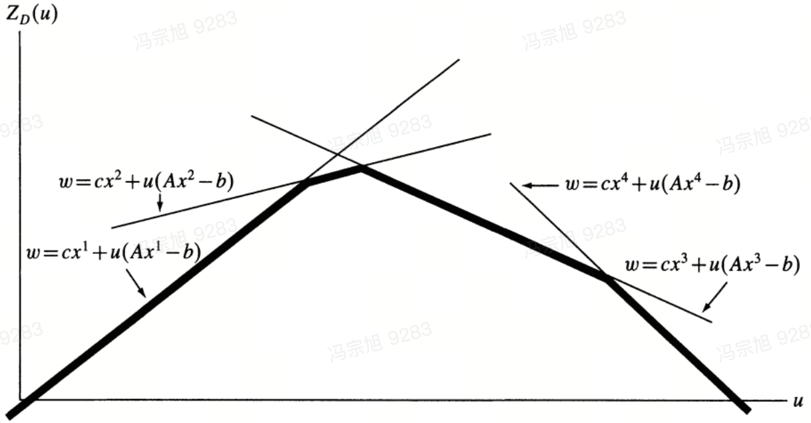

### Primal problem
$$
\min\tag{1.1}
f(x) \\
s.t \\
g(x) \leq b \\
h(x)=d \\
x \in X
$$

### Lagrange problem
$$
\min
f(x)+\lambda(g(x)-b)+\mu(h(x)-d) \\
s.t \\
\lambda \geq 0 \\
\mu\,free \\
x \in X\tag{1.2}
$$

>As we know

$$
\begin{gathered}
    \min_{x}\{f(x)+\lambda(g(x)-b)+\mu(h(x)-d)|g(x) \leq b,h(x) = d,x \in X\} \\
    \leq \\ 
    \min_{x}\{f(x)|g(x) \leq b,h(x) = d,x \in X\}\tag{1.3}
\end{gathered}
$$
<!-- $$
\begin{aligned}
    \min_{x}\{f(x)+\lambda(g(x)-b)+\mu(h(x)-d)|g(x) \leq b,h(x) = d,x \in X\} \\
    \leq \\ 
    \min_{x}\{f(x)|g(x) \leq b,h(x) = d,x \in X\}\tag{1.3}
\end{aligned}
$$ -->

>According to the optimization principle

<!-- - According to the optimization principle -->
$$
\begin{gathered}
    \min_{x}\{f(x)+\lambda(g(x)-b)+\mu(h(x)-d)|g(x) \leq b,h(x) = d,x \in X\} \\ \geq \\ 
    \min_{x}\{f(x)+\lambda(g(x)-b)+\mu(h(x)-d)|x \in X\}
\end{gathered}\tag{1.4}
$$

>Therefore

$$
\begin{aligned}
    \min_{x}\{f(x)+\lambda(g(x)-b)+\mu(h(x)-d)|x \in X\}\tag{1.5}
\end{aligned}
$$

*is a lower bound of primal problem, we hope to maximize this lower bound*

> For specific $\lambda$ and $\mu$, we can get an optimal $x$
> For this $x$ $\in$ $X$, we have the same lower bound

$$
\begin{aligned}
    L(\lambda, \mu) = (g(x)-b)\lambda+(h(x)-d)\mu+f(x)\tag{1.6}
\end{aligned}
$$

*It is a non-differentiable concave functions as follow:*

> *It is impossible for us to enumerate all $x$ $\in$ $X$, so we can not figure out the overall view of $L(\lambda,\mu)$, to find the "peak"*, subgradient is a good method to improve the lower bound

> *Then we update $\lambda$ and $\mu$, and re-optimize (1.5) to update $x$*

> *Loop until reach algorithm end criteria*

:exclamation:It is crucial to select accurate step size(learning rate), bad step size could lead to divergence